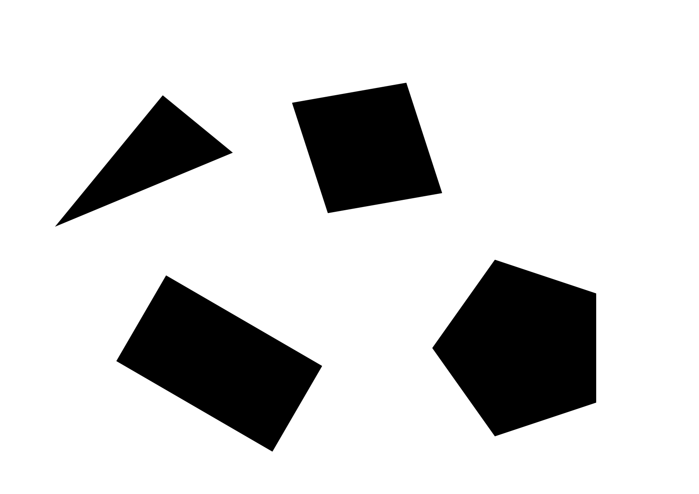

# Mobile Robots Project: Autonomous Navigation and Control

# Table of Contents
- [Overview](#overview)
  - [Objectives](#objectives)
  - [Hardware](#hardware)
- [Team Members](#team-members)
  - [Role Distribution](#role-distribution)
- [Introduction](#introduction)
  - [Project Demonstration](#project-demonstration)
- [Computer Vision](#computer-vision)
  - [Calibration](#calibration)
    - [Process](#process)
    - [Calibration Parameters](#calibration-parameters)
  - [ArUco Marker Detection](#aruco-marker-detection)
    - [Marker Configuration](#marker-configuration)
  - [Perspective Transform](#perspective-transform)
    - [Computing the Transform Matrix](#computing-the-transform-matrix)
    - [Applying the Transform](#applying-the-transform)
  - [Obstacle Detection](#obstacle-detection)
    - [Processing Pipeline](#processing-pipeline)
    - [Corner Filtering](#corner-filtering)
- [Global Navigation](#global-navigation)
- [Local Navigation](#local-navigation)
- [Filtering](#filtering)
- [Motion Control](#motion-control)
- [Conclusion](#conclusion)

## Overview
This project was developed as part of the **Basics of Mobile Robotics (MICRO-452)** course at EPFL, under the supervision of Professor Francesco Mondada from the [MOBOTS Laboratory](https://www.epfl.ch/labs/mobots/).

### Objectives
We aims to develop an autonomous navigation system for the Thymio robot that can:
1. Navigate through a predefined environment with static obstacles using global navigation
2. Dynamically avoid unexpected obstacles using local navigation
3. Maintain accurate position estimation through filtering
4. Reliably reach arbitrary target positions in the environment

### Hardware

| Peripheral            | Model    |
|------------           |----------|
| Robot                 | [Thymio II (MOBSYA)](https://www.thymio.org/) |
| Webcam        | [Aukey Webcam](https://www.aukey.com/) |


## Team Members

Our team consists of four first-year Master's students in Robotics at EPFL:

| Name            | SCIPER  |
|---------------- |---------|
| David XXX       | XXXX    |
| Ines XXX        | XXXX    |
| Michel XXX      | XXXX    |
| Rayan Gauderon  | 347428  |

### Role Distribution
The project responsibilities are distributed to maximize efficiency while ensuring each team member contributes to multiple aspects of the system:

- **Vision and Environment Processing**: Rayan and Michel
- **Path Planning and Navigation**: Ines and David
- **Robot Control and Localization**: All team members
- **System Integration and Testing**: All team members

# Introduction

Mobile robots that can move on their own are becoming more common in our daily lives, from robots that move boxes in warehouses to those that help at home. One of the main challenges for these robots is finding their way around while avoiding obstacles that might appear in their path.

In this project, we work with the Thymio II robot to create a system that helps it move safely from one point to another. Our solution combines two main ways of navigation: planning a full path ahead of time (using a map), and reacting to new obstacles that weren't there before (when someone puts something in the robot's way).

The project puts into practice many important ideas we learned in class: using cameras for seeing, creating paths for the robot to follow, keeping track of where the robot is, and making the robot move around obstacles. By bringing all these parts together, we've created a robot that can find its way around while dealing with changes in its environment.

### Project Demonstration

Below is a demonstration of our autonomous navigation system in action:

[Insert Video Here]

In this video, you can see:
- The Thymio robot navigating through our test environment
- Real-time path planning and execution
- Dynamic obstacle avoidance in action
- Position tracking with our vision system


## Computer Vision

### Calibration

Camera calibration is a crucial step in our computer vision pipeline, as it helps remove lens distortion and provides essential camera parameters. We implemented our calibration process based on this [OpenCV's guide](https://docs.opencv.org/4.x/dc/dbb/tutorial_py_calibration.html), using the checkerboard pattern below:

<p align="center">

</p>

#### Process

The calibration process involves:
1. Collecting a set of 15 images of a checkerboard pattern from different angles and distances to ensure robust calibration
2. Detecting the inner corners in each image using `cv2.findChessboardCorners()`, followed by corner position refinement to sub-pixel accuracy with `cv2.cornerSubPix()`
3. Using these detections to compute the camera's intrinsic parameters and distortion coefficients with `cv2.calibrateCamera()`

#### Calibration Parameters
The calibration provides two essential outputs:

1. **Camera Matrix**: A 3×3 matrix containing the camera's intrinsic parameters:
   - Focal lengths (fx, fy)
   - Principal point coordinates (cx, cy)
$$
M = 
\left( \begin{matrix}
f_x & 0 & c_x\\
0 & f_y & c_y\\
0 & 0 & 1
\end{matrix} \right)
$$
2. **Distortion Coefficients**: A vector containing the lens distortion parameters:
   - Radial distortion coefficients (k1, k2, k3)
   - Tangential distortion coefficients (p1, p2)
$$
D = 
\left( \begin{matrix} 
k_1 & k_2 & p_1 & p_2 & k_3
\end{matrix}\right)
$$

Once calibrated, we can undistort any frame from our camera providing a more accurate representation of the scene for subsequent vision processing steps:

```python
def _undistort_frame(self, frame):
    # Get optimal camera matrix to minimize unwanted pixels
    h, w = frame.shape[:2]
    newcameramtx, roi = cv2.getOptimalNewCameraMatrix(CAM_MATRIX, CAM_DISTORTION, (w, h), 1, (w, h))
    
    # Apply undistortion
    frame = cv2.undistort(frame, CAM_MATRIX, CAM_DISTORTION, None, newcameramtx)
    
    # Crop the frame to remove invalid pixels
    x, y, w, h = roi
    frame = frame[y:y+h, x:x+w]
    return frame
```
### ArUco Marker Detection

Our vision system uses ArUco markers for robust detection and tracking of the robot's position, orientation, and other key elements in the environment. We utilized [OpenCV's Aruco module](https://docs.opencv.org/4.x/d5/dae/tutorial_aruco_detection.html) with 4x4 markers.

#### Marker Configuration
The system uses different marker IDs for specific purposes:

- IDs 0-3: Corner markers for perspective transformation
- ID 4: Thymio robot position and orientation
- ID 5: Goal position

Here's the initialization of the ArUco detector:

```python
def __init__(self, device_id):
    # Initialize 4x4 ArUco marker detector with 50 unique markers
    self.aruco_dict = cv2.aruco.getPredefinedDictionary(cv2.aruco.DICT_4X4_50)
    self.parameters = cv2.aruco.DetectorParameters()
    self.detector = cv2.aruco.ArucoDetector(self.aruco_dict, self.parameters)
```
The detection process uses OpenCV's `detectMarkers()` function, which returns the corners and IDs of all detected markers in the frame.

### Perspective Transform

A perspective transform is implemented  to convert the camera's angled view into a top-down perspective, which is essential for accurate navigation and obstacle detection. We based our implementation on [OpenCV's geometric transformations](https://docs.opencv.org/4.x/da/d6e/tutorial_py_geometric_transformations.html). The map used can be find below:

<p align="center">

</p>

#### Computing the Transform Matrix

We use the four corner ArUco markers (IDs 0-3) as reference points to compute the perspective transformation matrix. The process involves mapping these source points to destination points that represent a rectangular top-down view:

```python
def _compute_perspective_transform(self, source_points, world_width, world_height):
    # Calculate pixel to millimeter scale factor
    self.scale_factor = CAM_RESOLUTION[1] / world_width
    
    # Calculate dimensions of transformed image
    dest_width = world_width * self.scale_factor 
    dest_height = world_height * self.scale_factor 
    
    # Define destination points for top-down view
    dest_points = np.float32([
        [0, dest_height],          # bottom-left
        [dest_width, dest_height], # bottom-right
        [0, 0],                    # top-left
        [dest_width, 0]            # top-right  
    ])
    
    # Calculate perspective transformation matrix
    self.perspective_matrix = cv2.getPerspectiveTransform(source_points, dest_points)
```

#### Applying the Transform

Once we have the transformation matrix, we can convert any frame to a top-down view using `cv2.warpPerspective`:

```python
def get_frame(self):
    # Capture frame and apply perspective transform
    original_frame = self._get_original_frame()
    process_frame = cv2.warpPerspective(original_frame, 
                                      self.perspective_matrix, 
                                      self.process_roi)  
    return original_frame, process_frame
```

This transformation allows us to:
- Convert camera coordinates to real-world coordinates
- Obtain accurate measurements for robot navigation
- Simplify obstacle detection and path planning algorithms

### Obstacle Detection

Our obstacle detection system combines Canny edge detection and contour finding from OpenCV to identify obstacles in the environment. The implementation is based on [OpenCV's Canny Edge Detection](https://docs.opencv.org/4.x/da/d22/tutorial_py_canny.html) and [Contour Detection](https://docs.opencv.org/3.4/d4/d73/tutorial_py_contours_begin.html) tutorials. A typical environment with different shape obstacles can be seen below:

<p align="center">

</p>

#### Processing Pipeline

The obstacle detection follows a multi-stage image processing pipeline designed to reliably identify obstacles of various shapes and sizes:

**Image Preprocessing**:
First, we prepare the image for edge detection through several preprocessing steps:
```python
# Convert to grayscale and apply Gaussian blur
gray_frame = cv2.cvtColor(frame, cv2.COLOR_RGB2GRAY)
blurred_frame = cv2.GaussianBlur(gray_frame, (5, 5), 0)

# Apply Otsu's thresholding
_, threshold_frame = cv2.threshold(blurred_frame, 0, 255, 
                                 cv2.THRESH_BINARY + cv2.THRESH_OTSU)
```
The Gaussian blur helps reduce noise while preserving edges, and Otsu's thresholding automatically determines the optimal threshold value for binarization.

**Edge Detection**:
We use the Canny edge detector, which is known for its ability to detect true edges while minimizing false detections:
```python
# Apply Canny edge detection
edges_frame = cv2.Canny(threshold_frame, 50, 150)
```
The parameters 50 and 150 represent the lower and upper thresholds for the hysteresis procedure in Canny edge detection.

<p align="center">

</p>

**Contour Detection and Processing**:
After edge detection, we find and process contours to identify obstacle boundaries:
```python
# Find contours of obstacles
contours, _ = cv2.findContours(edges_frame, 
                              cv2.RETR_EXTERNAL, 
                              cv2.CHAIN_APPROX_SIMPLE)

# Process each contour above minimum area threshold
for contour in contours:
    if cv2.contourArea(contour) <= OBSTACLE_MIN_AREA:
        continue
        
    # Approximate contour with polygon
    epsilon = 0.02 * cv2.arcLength(contour, True)
    approx = cv2.approxPolyDP(contour, epsilon, True)
    corners = approx.reshape(-1, 2).astype(np.float32)
```
We use `cv2.RETR_EXTERNAL` to only retrieve the outer contours, and `cv2.CHAIN_APPROX_SIMPLE` to compress horizontal, vertical, and diagonal segments and leave only their end points. The `OBSTACLE_MIN_AREA` threshold helps filter out small noise contours.

<p align="center">

</p>

#### Corner Filtering

To ensure accurate obstacle representation while minimizing computational complexity, we implement a corner filtering mechanism that removes redundant points:

```python
def _filter_close_corners(self, corners, min_distance=10):
    # Return empty list if no corners
    if len(corners) == 0:
        return corners
    
    corners = np.array(corners)
    filtered_corners = [corners[0]]
    
    # Keep corners that are at least min_distance away from all kept corners
    for corner in corners[1:]:
        if all(utils.distance(corner, kept_corner) >= min_distance 
               for kept_corner in filtered_corners):
            filtered_corners.append(corner)
    
    return np.array(filtered_corners)
```

This filtering process:
- Starts with the first corner point
- Adds subsequent corners only if they are at least `min_distance` pixels away from all previously kept corners
- Helps create a more efficient representation of obstacles while maintaining their shape accuracy

Finally, the detected obstacle corners are converted from pixel coordinates to millimeters using our perspective transform scale factor. This conversion is crucial for the navigation system as it needs real-world measurements to plan paths and avoid obstacles effectively.

The combination of these processing steps creates a robust obstacle detection system that:
- Works reliably under varying lighting conditions
- Handles obstacles of different shapes and sizes
- Provides accurate position information in real-world coordinates
- Minimizes false detections through filtering

## Global navigation

## Local Navigation

## Filtering

## Motion Control

## Conclusion

